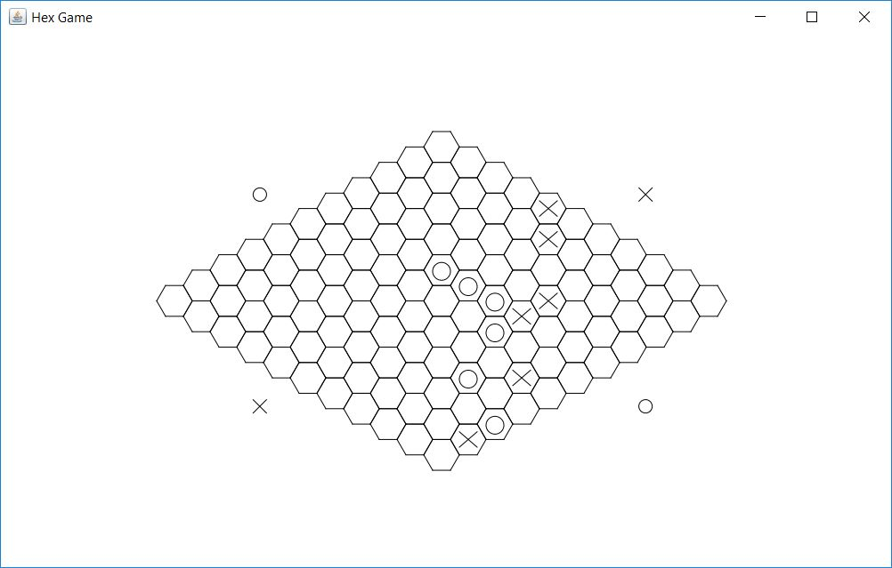

# Game of Hex

An implementation of the game of [Hex](https://en.wikipedia.org/wiki/Hex_(board_game)) in Java.

### Rules:

Two players take consecutive turns filling on a 11x11 board with X and O until one constructs a bridge between their two sides of the map.

### Example

